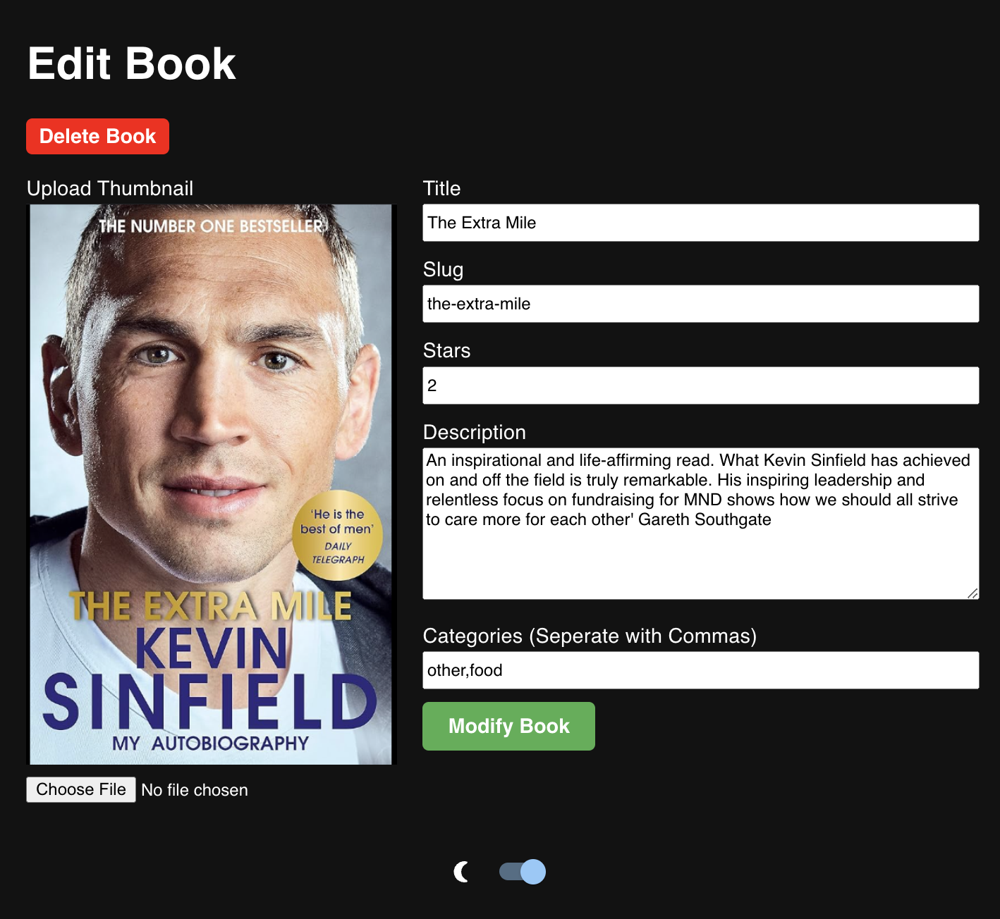

# Librarian ☛📚

**Librarian** is a personal book management system built with the **MERN stack** (MongoDB, Express, React, Node.js). Whether you're a passionate bookworm or someone who loves staying organized, Librarian provides a seamless experience for managing your personal library.

---

## ✨ Effortless Book Management

<div align="center">
  
  

</div>

- Add, update, and organize books in your collection.
- View details such as titles, authors, genres, and more.

<div align="center">
  
  
  
</div>
---

## 🌑 Light and Dark Mode

- Choose between a light mode for daytime browsing and a dark mode for comfortable nighttime browsing.

<div align="center">
  
  

</div>

---

## 💡 User-Friendly Interface

- Intuitive UI design for a smooth experience.
- Responsive layout that works across desktop, tablet, and mobile devices.

---

## 💻 MERN Stack Foundation

- Built with **MongoDB, Express, React, and Node.js** to ensure speed and reliability.

---

## 🧠 Future Enhancements

- Integrating a **machine learning model** 🤖 to analyze your library and recommend personalized book suggestions.
- Get smart recommendations based on the genres and authors you love.

---

## 🚀 Installation Guide

Follow these steps to set up **Librarian** locally:

### 1. Clone the Repository and open the source code folder
```bash
git clone https://github.com/your-username/librarian.git
cd BOOKKEEPER 

``` 

### 2. Open the frontend folder and download the necessary dependencies
```bash
cd bookapp
npm install

``` 

### 2. Open the backend server and download the necessary dependencies
```bash
cd ../ 
cd server
npm install

``` 

### 3. Make sure you have a .env file in your server folder with the MongoDB URI you wish to connect your app to. 
```bash
touch .env 
```
now this will create a .env file. open this file in your terminal or with an IDE of your choice and paste the following line:

MONGODB_URI = [insert your MongdoDB URI here]


### 4. Repeat the following steps in the bookapp and server folder:
```bash

npm run dev


``` 

### 5. Navigate to localhost and enjoy Librarian!:


### 🔗 Stay Connected

If you're interested in contributing or have ideas for new features, feel free to **open an issue** or **submit a pull request**. Let's make Librarian even better together!

Thank you for exploring Librarian! Happy reading! 📚✨
