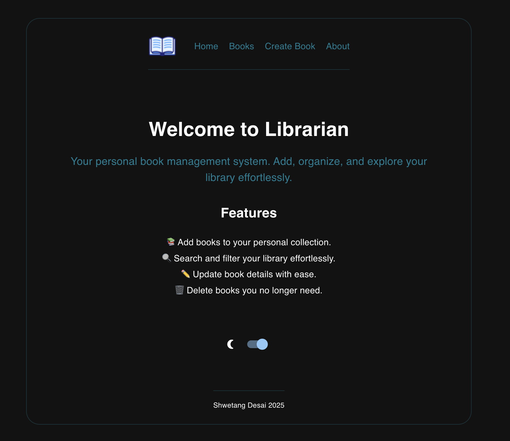

# Librarian ☛📚

**Librarian** is a personal book management system built with the **MERN stack** (MongoDB, Express, React, Node.js). Whether you're a passionate bookworm or someone who loves staying organized, Librarian provides a seamless experience for managing your personal library.

---

## ✨ Effortless Book Management

  
  

- Add, update, and organize books in your collection.
- View details such as titles, authors, genres, and more.

  
  
  

---

## 🌑 Light and Dark Mode

- Choose between a light mode for daytime browsing and a dark mode for comfortable nighttime browsing.

  
  

---

## 💡 User-Friendly Interface

- Intuitive UI design for a smooth experience.
- Responsive layout that works across desktop, tablet, and mobile devices.

---

## 💻 MERN Stack Foundation

- Built with **MongoDB, Express, React, and Node.js** to ensure speed and reliability.

---

## 🧠 Future Enhancements

- Integrating a **machine learning model** 🤖 to analyze your library and recommend personalized book suggestions.
- Get smart recommendations based on the genres and authors you love.

---

### 🔗 Stay Connected

If you're interested in contributing or have ideas for new features, feel free to **open an issue** or **submit a pull request**. Let's make Librarian even better together!

Thank you for exploring Librarian! Happy reading! 📚✨
